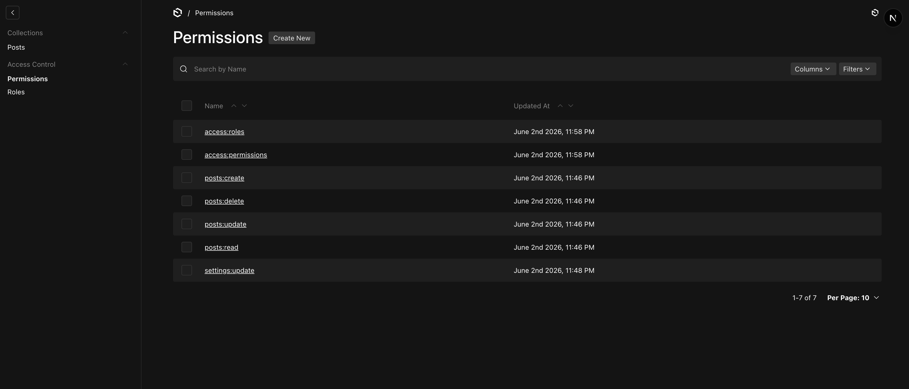
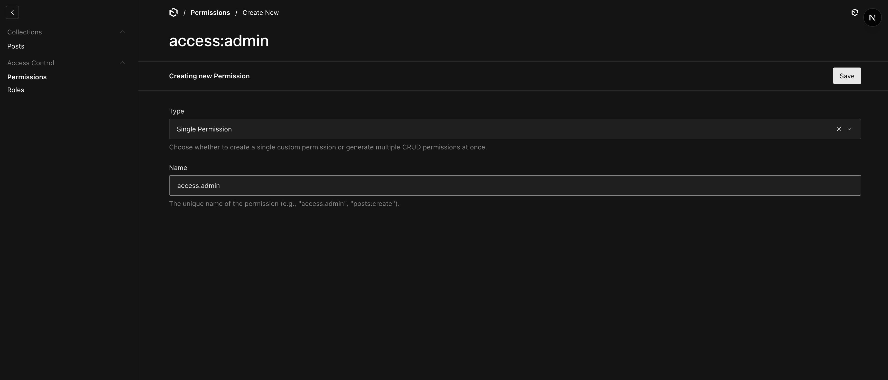
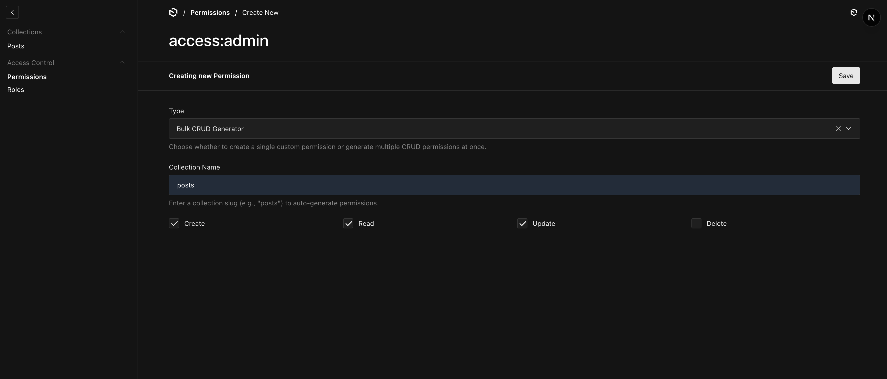
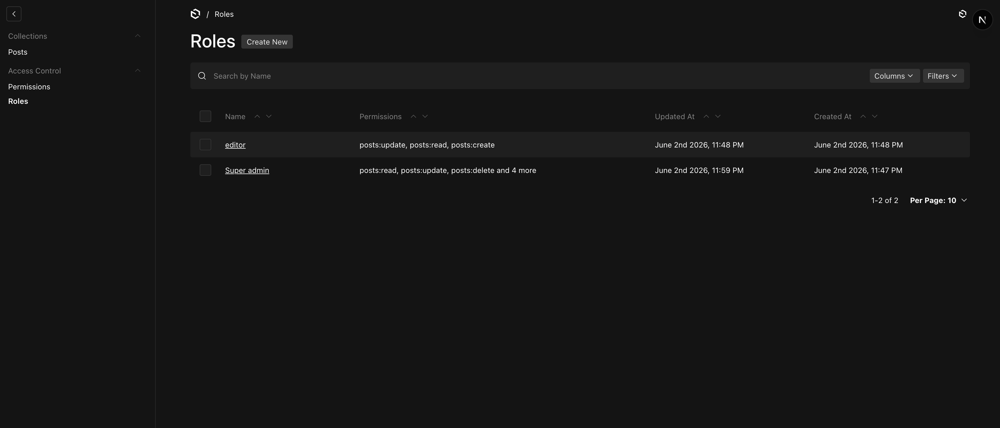
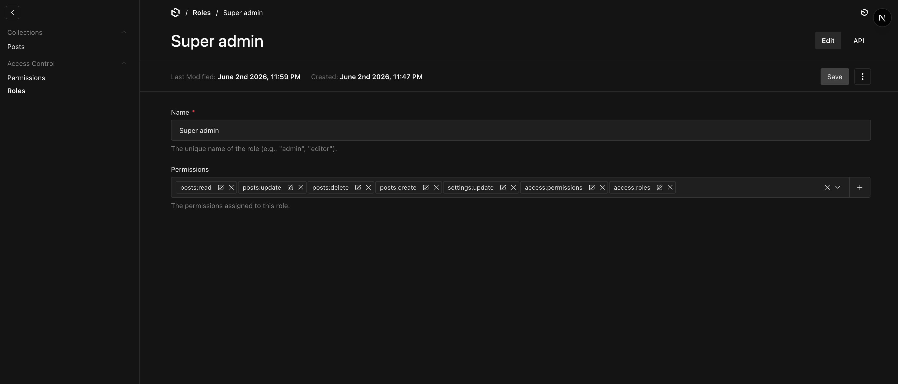

# Payload CMS Dynamic RBAC Plugin

A professional, database-backed Role-Based Access Control (RBAC) system for [Payload CMS](https://payloadcms.com) (v3). 

This plugin emphasizes checking **permissions instead of roles** to avoid hard-coded authorization logic in your source code, making your access control highly scalable, modular, and dynamic.

---

## Features

- **Dynamic Collections**: Automatically injects database-backed `Roles` and `Permissions` collections.
- **Auth Collection Extension**: Injects a `roles` relationship field into your target auth collection (e.g., `users`) with `saveToJWT: true` for zero-cost runtime checks.
- **Bulk Permission Generator**: In the Admin UI, easily switch between creating a single permission or using the Bulk CRUD Generator to automatically generate separate permissions (e.g., `posts:create`, `posts:read`, `posts:update`, `posts:delete`) at once. 
- **UI-Only Helpers**: Bulk generator fields (`type`, `collectionName`, CRUD checkboxes) are purely for the UI and are never saved to your database, keeping your collections clean.
- **Customizable Schemas**: Allow developers to inject additional custom fields into both `Roles` and `Permissions` schemas.
- **Granular Control**: Set visibility permissions (`hideRoles`, `hidePermissions`) dynamically or statically for the RBAC admin interface.
- **Helper Utilities**: Simple and robust functions to check permissions (`hasPermission`) and access control wrappers (`checkPermission`).
- **Fully Tested**: Powered by a robust integration and unit test suite built with Vitest.

## Screenshots

### 1. Permissions List View
Shows flat generated permissions (e.g. `posts:create`, `posts:read`) and legacy system permissions.


### 2. Single Permission Form
Create individual custom permissions.


### 3. Bulk CRUD Generator Form
Select a collection and check CRUD actions to instantly generate multiple permissions.


### 4. Roles List View
Displays roles and all permissions associated with them.


### 5. Role Configuration Form
Assign permissions directly to roles in the admin UI.


---

## Installation

Add the plugin to your project:

```bash
pnpm add payload-rbac
# or
npm install payload-rbac
# or
yarn add payload-rbac
```

---

## Setup & Configuration

Import and configure the plugin in your `payload.config.ts`:

```typescript
import { buildConfig } from 'payload'
import { rbac, hasPermission } from 'payload-rbac'

export default buildConfig({
  collections: [
    {
      slug: 'posts',
      fields: [],
    },
  ],
  plugins: [
    rbac({
      enabled: true,
      // Optional configurations:
      authCollectionSlug: 'users',        // Default: 'users'
      rolesCollectionSlug: 'roles',        // Default: 'roles'
      permissionsCollectionSlug: 'permissions', // Default: 'permissions'
      
      // Control access/visibility of the RBAC panel:
      hidePermissions: ({ user }) => !hasPermission(user, 'access:permissions'),
      hideRoles: ({ user }) => !hasPermission(user, 'access:roles'),
    }),
  ],
})
```

### Configuration Options

| Option | Type | Default | Description |
| :--- | :--- | :--- | :--- |
| `enabled` | `boolean` | `true` | Enable or disable the plugin. |
| `authCollectionSlug` | `string` | `'users'` | The collection slug representing the users collection. |
| `rolesCollectionSlug` | `string` | `'roles'` | The slug for the automatically injected Roles collection. |
| `permissionsCollectionSlug` | `string` | `'permissions'` | The slug for the automatically injected Permissions collection. |
| `rolesFields` | `Field[]` | `[]` | Extra custom fields to inject into the Roles collection. |
| `permissionsFields` | `Field[]` | `[]` | Extra custom fields to inject into the Permissions collection. |
| `hideRoles` | `boolean \| ((args: { user: any }) => boolean)` | `false` | Hide the Roles collection from the sidebar navigation. |
| `hidePermissions` | `boolean \| ((args: { user: any }) => boolean)` | `false` | Hide the Permissions collection from the sidebar navigation. |

---

## Usage

### 1. Protecting Collections (Access Control)

You can protect collections using the `checkPermission` Higher-Order Function. It returns a standard Payload `Access` control resolver.

```typescript
import { checkPermission } from 'payload-rbac'

export const PostsCollection = {
  slug: 'posts',
  access: {
    create: checkPermission('posts:create'),
    read: checkPermission('posts:read'),
    update: checkPermission('posts:update'),
    delete: checkPermission('posts:delete'),
  },
  fields: [],
}
```

### 2. Manual Permission Verification (`hasPermission`)

For custom endpoints, hooks, or conditionally rendering logic, use the `hasPermission` utility:

```typescript
import { hasPermission } from 'payload-rbac'

const myCustomEndpoint = (req, res) => {
  const user = req.user
  
  if (hasPermission(user, 'export:reports')) {
    // allow operation
  } else {
    res.status(403).send('Forbidden')
  }
}
```

---

## Bulk Permission Generator UI

When navigating to the **Permissions** collection in your Payload Admin panel:
1. Select **Bulk CRUD Generator** in the `Type` select box (visible only during document creation).
2. Enter the target collection slug (e.g. `posts`) in the `Collection Name` field.
3. Check the CRUD operations you wish to generate (e.g., `create`, `read`).
4. Save the document.
5. The plugin runs a `beforeChange` hook that creates individual flat records (`posts:create`, `posts:read`) in the database, and avoids saving any temporary helper fields to the database.

---

## Development & Testing

If you are developing this plugin locally, you can run the test suite:

```bash
# Run unit and integration tests
pnpm test:int

# Run tests in watch mode
pnpm test:int --watch
```

---

## License

MIT
